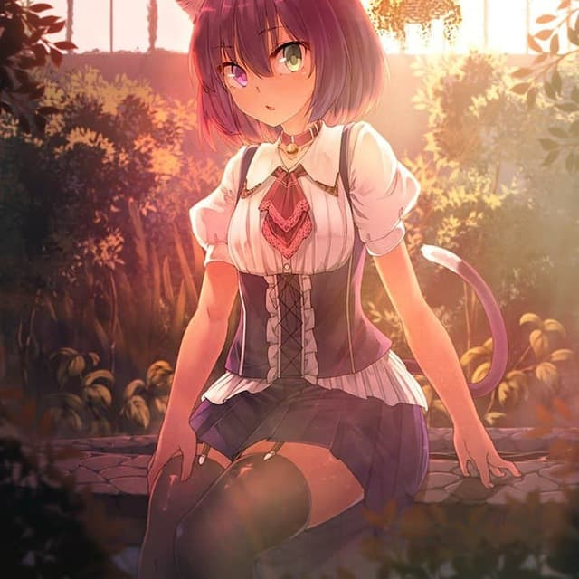

<p align="center">
  </img><br><br>
  </img>
  </img>
  </img>
</p>

# Random-Good-Hanime
Hentai Telegram bot for educational purpose :wink:

# Features 
- Random hentai 
- Lot of different categories :yum:
- Real time logs :scroll:
- Config file :page_facing_up:

# Test bot
Search **@Random_Good_Hanime_bot** on Telegram <br> <br>


# How to build
```bash
git clone https://github.com/Superredstone/Random-Good-Hanime.git
cd Random-Good-Hanime-Main
go get gopkg.in/tucnak/telebot.v2
go build main.go
```

# How to start APIs
```bash
git clone https://github.com/Superredstone/Random-Good-Hanime.git
cd Random-Good-Hanime-Main/Images/API/
pip install simple_image_download
python3 downloader.py
npm install express
node main.js
```

# APIs written by me
You can find them on https://random-good-hanime-api.herokuapp.com/

# TODO
- ~~Love hentais~~
- ~~Readable README.md~~
- ~~Updater~~ :arrow_down_small:
- ~~Improve performance~~

# License
GNU GPL V3
